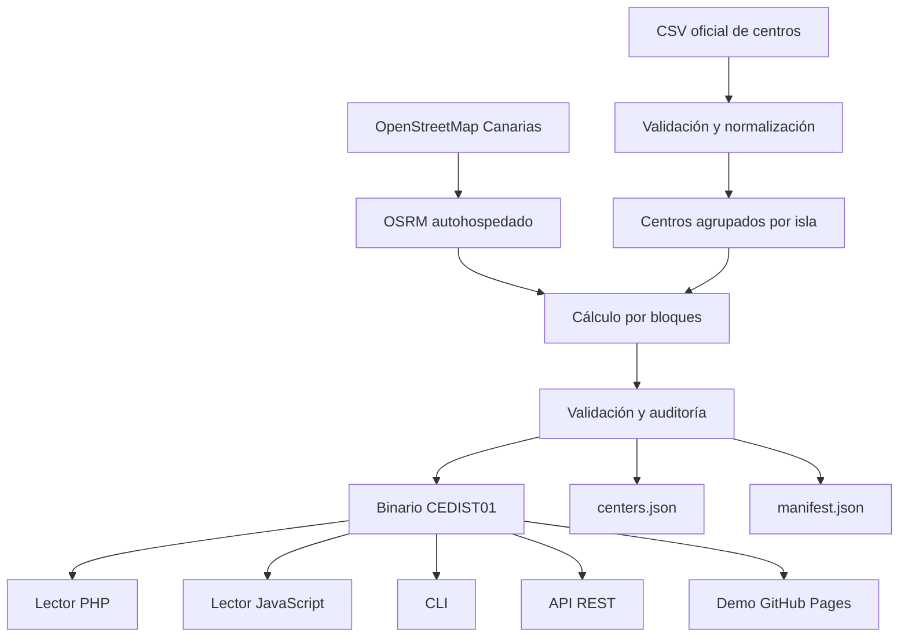

# Creación del repositorio `ateeducacion/distancias_centros_educativos_canarias`

Actúa como arquitecto de software, especialista en datos geoespaciales, desarrollador Python/PHP/JavaScript y responsable de automatización CI/CD.

Crea un repositorio completo y funcional llamado:

```text
distancias_centros_educativos_canarias
```

El repositorio estará destinado a la organización:

```text
https://github.com/ateeducacion
```

No te limites a generar una propuesta o un esquema. Crea los archivos reales del proyecto, implementa el código, añade pruebas y ejecuta localmente todos los linters y tests disponibles.

No hagas `git push`, no crees el repositorio remoto, no publiques releases, no abras issues ni pull requests y no modifiques recursos de GitHub. Limítate a preparar el repositorio local y los workflows que permitirán hacer esas operaciones posteriormente.

## 1. Nombre y descripción del producto

Título público:

```text
Distancias entre centros educativos de Canarias
```

Nombre técnico corto:

```text
Canarias Education Route Matrix
```

Descripción para GitHub:

```text
Matriz abierta y versionada de distancias y tiempos por carretera entre centros educativos de Canarias, generada con datos oficiales y OpenStreetMap.
```

Topics sugeridos:

```text
canarias
educacion
centros-educativos
open-data
openstreetmap
osrm
route-matrix
distance-matrix
php
javascript
python
github-pages
zensical
```

## 2. Objetivo funcional

El proyecto debe generar y publicar una matriz estática y compacta con:

* Distancia por carretera en metros.
* Duración estimada en segundos.
* Origen y destino identificados mediante el código oficial del centro.
* Rutas calculadas únicamente entre centros de la misma isla.
* Matrices dirigidas: `A → B` puede ser diferente de `B → A`.
* Información de procedencia y fecha de los datos.
* Resultados reproducibles y verificables.
* Lectura directa desde PHP.
* Lectura directa desde JavaScript en navegador y Node.js.
* Una CLI para consultas.
* Una API REST opcional en PHP.
* Una página web estática para probar consultas.
* Documentación generada con Zensical y publicada en GitHub Pages.

No debe realizarse ningún cálculo de rutas durante una consulta normal. Todo el cálculo debe hacerse durante la generación de los artefactos.

No debe dependerse de Google Maps, Google Routes, Mapbox ni servicios comerciales para calcular o consultar las rutas.

## 3. Fuentes oficiales

### 3.1 Centros educativos

Página de entrada indicada por el organismo:

```text
https://datos.canarias.es/catalogos/general/dataset/centros-educativos
```

Conjunto concreto que debe localizarse:

```text
https://datos.canarias.es/catalogos/general/dataset/centros-educativos-de-canarias
```

Recurso CSV conocido actualmente:

```text
https://datos.canarias.es/catalogos/general/dataset/f6b15811-014b-46f7-a858-fe48b062ed05/resource/b5e08adf-841b-4ba5-a599-4339e772d792/download/centros.csv
```

No dependas exclusivamente de que esa URL de recurso permanezca inmutable.

Implementa un resolvedor que:

1. Intente obtener los metadatos actuales del conjunto mediante la API CKAN del portal, cuando esté disponible.
2. Localice el recurso activo cuyo nombre sea `centros.csv`.
3. Verifique que el formato sea CSV.
4. Extraiga la URL de descarga actual.
5. Utilice la URL conocida como fallback configurable.
6. Falle con un error claro si encuentra varios recursos ambiguos.
7. Registre la URL final, el `ETag`, `Last-Modified`, tamaño y SHA-256.
8. No continúe silenciosamente si cambia el esquema.

La descarga debe soportar:

* Redirecciones.
* Reintentos con backoff.
* Timeout.
* Descarga temporal y renombrado atómico.
* Peticiones condicionales con `ETag` o `Last-Modified`.
* Verificación de que el contenido recibido es realmente CSV.
* Cálculo de SHA-256.
* Registro estructurado de errores.

### 3.2 Datos de carreteras

Utiliza un extracto actual de OpenStreetMap para Canarias, preferentemente el publicado por Geofabrik:

```text
https://download.geofabrik.de/africa/canary-islands-latest.osm.pbf
```

La URL debe estar en configuración y no repetida en varios scripts.

Registra:

* URL.
* Fecha de descarga.
* `ETag`.
* `Last-Modified`.
* Tamaño.
* SHA-256.
* Versión de OSRM.
* Digest de la imagen Docker.
* Hash del perfil de enrutamiento.

## 4. Tratamiento de los códigos de centro

El campo oficial `Codigo` es la clave pública del centro.

Reglas obligatorias:

* No reasignar códigos.
* No convertir los códigos en números pares.
* No exigir que sean consecutivos.
* No usar paridad para distinguir entidades.
* No usar `idCentro` como identificador público.
* Conservar el código como cadena en JSON, API y documentación.
* Validar inicialmente que se ajuste a `^[0-9]{8}$`.
* Hacer que la regla de validación sea configurable.
* Detener el pipeline si el organismo cambia el formato.
* Convertir el código a `uint32` únicamente en la representación binaria.
* Verificar que el valor cabe en `uint32`.
* Ordenar el índice binario global de forma ascendente por código.
* Implementar búsqueda binaria en los lectores.
* Permitir opcionalmente un índice hash en memoria para procesos persistentes.

La API debe devolver:

```json
{
  "code": "35000011"
}
```

No debe devolverlo como número JSON, para evitar pérdida de formato o problemas si en el futuro aparecen ceros iniciales.

Si en futuras versiones se incorporan aeropuertos, centros de salud u otros puntos de interés, deberán utilizar:

```text
entity_type
external_code
internal_id
```

No debe reservarse la paridad ni rangos improvisados de códigos oficiales.

La versión 1 del formato debe contener únicamente centros educativos.

## 5. Validación y normalización del CSV

Implementa un importador robusto para CSV UTF-8.

Como mínimo, valida la presencia de:

```text
Codigo
Denominacion
Direccion
Localidad
Municipio
Isla
Provincia
Naturaleza
TipoCentro
Longitud
Latitud
```

Requisitos:

* Detectar BOM UTF-8.
* No asumir el orden de las columnas.
* Validar encabezados por nombre.
* Detectar códigos duplicados.
* Detectar filas sin código.
* Detectar coordenadas vacías o no numéricas.
* Verificar que longitud y latitud están en rangos válidos.
* Verificar razonablemente que las coordenadas corresponden a Canarias.
* Detectar cambios en el delimitador.
* Detectar errores de codificación.
* Normalizar espacios exteriores.
* Conservar tildes, eñes y nombres originales.
* No transformar denominaciones a mayúsculas o minúsculas.
* Normalizar nombres de isla a identificadores internos estables.
* Generar un informe de validación legible por humanos y otro en JSON.
* No descartar silenciosamente ninguna fila.
* Permitir filtros configurables por `TipoCentro` o `Naturaleza`.
* Incluir por defecto todos los registros válidos del recurso oficial.
* Mostrar en el manifiesto cuántos registros fueron incluidos, excluidos o rechazados.

Normaliza las islas a identificadores internos, por ejemplo:

```text
1 = EL_HIERRO
2 = FUERTEVENTURA
3 = GRAN_CANARIA
4 = LA_GOMERA
5 = LA_PALMA
6 = LANZAROTE
7 = TENERIFE
```

No dependas del orden alfabético para asignar esos identificadores. Documenta y prueba la tabla.

No presupongas cifras concretas de centros o rutas. Todos los conteos del README y de la documentación deben generarse desde el manifiesto actual.

## 6. Privacidad y minimización de datos

El CSV puede contener teléfonos, correos electrónicos, fotografías y otros campos que no son necesarios para consultar distancias.

El artefacto público `centers.json` debe contener solamente:

```text
code
name
island
island_id
municipality
locality
address
postal_code
longitude
latitude
nature
center_type
```

No publiques en los artefactos derivados:

* Teléfonos.
* Fax.
* Correos electrónicos.
* Fotografías.
* URLs internas.
* Información de adscripción que no sea necesaria.
* Datos que no se utilicen en la aplicación.

Documenta la minimización realizada.

## 7. Motor de rutas

Utiliza OSRM autohospedado.

Usa el algoritmo MLD:

```text
osrm-extract
osrm-partition
osrm-customize
osrm-routed --algorithm mld
```

Usa una imagen Docker oficial o mantenida por el proyecto OSRM.

No utilices `latest` sin control. Fija:

* Versión.
* Digest SHA-256 cuando sea viable.
* Versión en un único archivo de configuración.
* Actualizaciones mediante Dependabot cuando estén soportadas.

El perfil inicial será:

```text
car-fastest
```

La métrica debe documentarse exactamente como:

```text
Distancia y duración correspondientes a la ruta para automóvil considerada
más rápida por el perfil OSRM utilizado, sin tráfico en tiempo real.
```

No la describas como «ruta más corta», porque la distancia devuelta corresponde a la ruta más rápida seleccionada por OSRM.

Guarda:

* Distancia en metros.
* Duración en segundos.

Redondea los valores de OSRM a enteros no negativos mediante una política documentada y probada.

## 8. Ajuste de coordenadas a la red viaria

Antes de calcular las matrices:

1. Consulta el servicio `nearest` de OSRM.
2. Obtén la coordenada ajustada a la red.
3. Calcula la separación entre la coordenada oficial y la ajustada.
4. Registra el valor en un informe.
5. Marca los casos anómalos.
6. No reemplaces silenciosamente la coordenada oficial en los metadatos públicos.
7. Utiliza la coordenada ajustada únicamente para el cálculo de rutas.
8. Conserva ambas coordenadas en los datos internos de auditoría.

El umbral de advertencia debe ser configurable.

No inventes un umbral sin justificarlo. Define un valor inicial conservador en configuración y documenta que es una política del proyecto, no una propiedad universal.

Una separación elevada debe producir una advertencia. Una separación extrema debe poder detener el pipeline según configuración.

## 9. Cálculo por islas

Nunca calcules rutas entre islas.

Agrupa los centros por `island_id`.

Para cada isla:

* Ordena los centros por código.
* Asigna un `local_index` desde cero.
* Calcula una matriz cuadrada dirigida.
* Incluye la diagonal.
* Establece distancia y duración cero para un centro consigo mismo.
* Detecta rutas no disponibles.
* Registra el número de rutas válidas y no disponibles.

El cálculo debe ejecutarse por bloques configurables.

Ejemplo:

```text
sources: bloques de 50 o 100 centros
destinations: bloques de 50 o 100 centros
```

El tamaño debe poder ajustarse mediante configuración o variable de entorno.

Implementa:

* Reintentos.
* Backoff.
* Timeout.
* Checkpoints.
* Reanudación.
* Logs estructurados.
* Validación de dimensiones.
* Validación de valores negativos.
* Detección de respuestas incompletas.
* Limitación de concurrencia.
* Escritura atómica.
* Eliminación segura de resultados parciales inválidos.

No asumas que la matriz es simétrica.

## 10. Formato binario

Usa un formato propio, documentado y versionado.

Nombre inicial del formato:

```text
CEDIST01
```

Características:

* Little-endian.
* Registros de tamaño fijo.
* Índice global ordenado.
* Matrices densas por isla.
* Acceso aleatorio.
* Sin compresión en el fichero utilizado para consultas.
* Copia comprimida con Zstandard para distribución.
* SHA-256 externo en el manifiesto.
* Compilación determinista.

### 10.1 Cabecera

Define una cabecera fija de 64 bytes:

```text
Offset  Size  Type       Field
0       8     char[8]    magic = "CEDIST01"
8       2     uint16     format_major
10      2     uint16     format_minor
12      4     uint32     header_size
16      4     uint32     flags
20      2     uint16     island_count
22      2     uint16     reserved
24      4     uint32     center_count
28      8     uint64     global_index_offset
36      8     uint64     island_directory_offset
44      8     uint64     file_size
52      12    bytes      reserved
```

Los campos reservados deben escribirse como cero y validarse al leer.

### 10.2 Índice global

Ordena los registros por `center_code`.

Cada registro debe ocupar 12 bytes:

```text
Offset  Size  Type      Field
0       4     uint32    center_code
4       1     uint8     island_id
5       1     uint8     flags
6       2     uint16    local_index
8       4     uint32    metadata_index
```

La búsqueda debe realizarse mediante búsqueda binaria.

### 10.3 Directorio de islas

Cada registro debe ocupar 24 bytes:

```text
Offset  Size  Type      Field
0       1     uint8     island_id
1       3     bytes     reserved
4       4     uint32    center_count
8       8     uint64    distance_matrix_offset
16      8     uint64    duration_matrix_offset
```

### 10.4 Matrices

Cada matriz se almacena en orden row-major:

```text
position = origin_local_index * center_count + destination_local_index
```

Cada valor será `uint32`.

Convenciones:

```text
0x00000000 = mismo centro
0xFFFFFFFF = ruta no disponible
```

Distancias:

```text
metros
```

Duraciones:

```text
segundos
```

No utilices valores mágicos adicionales sin documentarlos.

### 10.5 Compatibilidad

Los lectores deben:

* Rechazar un `magic` desconocido.
* Rechazar versiones mayores incompatibles.
* Validar offsets.
* Validar tamaños.
* Detectar truncamiento.
* Detectar overflow al calcular posiciones.
* Verificar que el centro pertenece a la isla declarada.
* Devolver un error específico para consultas entre islas.
* Devolver un resultado específico para rutas no disponibles.
* No confundir una ruta no disponible con una distancia cero.

Prepara `docs/FORMAT.md` con:

* Tabla de offsets.
* Diagrama ASCII.
* Ejemplos hexadecimales.
* Test vectors.
* Política de versionado.
* Procedimiento para añadir campos.
* Reglas de compatibilidad hacia atrás.

## 11. Artefactos generados

Genera:

```text
dist/canarias-education-routes.bin
dist/canarias-education-routes.bin.zst
dist/centers.json
dist/centers.min.json
dist/manifest.json
dist/validation-report.json
dist/validation-report.md
dist/SHA256SUMS
```

El manifiesto debe incluir, al menos:

```json
{
  "schema_version": 1,
  "format": {
    "magic": "CEDIST01",
    "major": 1,
    "minor": 0,
    "endianness": "little"
  },
  "generated_at": "...",
  "data_version": "...",
  "centers_source": {
    "dataset_url": "...",
    "resource_url": "...",
    "etag": "...",
    "last_modified": "...",
    "sha256": "..."
  },
  "osm_source": {
    "url": "...",
    "etag": "...",
    "last_modified": "...",
    "sha256": "..."
  },
  "routing": {
    "engine": "OSRM",
    "version": "...",
    "docker_digest": "...",
    "algorithm": "MLD",
    "profile": "car-fastest",
    "profile_sha256": "..."
  },
  "counts": {
    "centers": 0,
    "directed_routes": 0,
    "unreachable_routes": 0,
    "islands": {}
  },
  "artifacts": {}
}
```

No escribas conteos, fechas, tamaños o hashes ficticios.

Calcula todos los valores durante la generación.

La compilación debe ser determinista:

* Orden estable.
* JSON con orden estable de claves.
* Separadores definidos.
* Saltos de línea consistentes.
* Sin rutas absolutas.
* Sin timestamps variables dentro del binario.
* Usa `SOURCE_DATE_EPOCH` cuando proceda.
* Mantén `generated_at` en el manifiesto, no como causa innecesaria de variación del binario.

## 12. Estructura del repositorio

Crea una estructura similar a esta, ajustándola solo cuando exista una razón técnica clara:

```text
distancias_centros_educativos_canarias/
├── .github/
│   ├── ISSUE_TEMPLATE/
│   │   ├── bug_report.yml
│   │   ├── data_problem.yml
│   │   ├── feature_request.yml
│   │   └── config.yml
│   ├── workflows/
│   │   ├── ci.yml
│   │   ├── update-data.yml
│   │   ├── release.yml
│   │   ├── docs.yml
│   │   └── codeql.yml
│   ├── CODEOWNERS
│   ├── dependabot.yml
│   └── pull_request_template.md
├── api/
│   ├── public/
│   │   └── index.php
│   ├── src/
│   ├── tests/
│   ├── composer.json
│   └── phpunit.xml.dist
├── config/
│   ├── project.toml
│   ├── islands.json
│   ├── sources.json
│   └── routing.json
├── data/
│   ├── samples/
│   │   ├── sample.bin
│   │   ├── sample-centers.json
│   │   └── sample-manifest.json
│   ├── schemas/
│   │   ├── centers.schema.json
│   │   ├── manifest.schema.json
│   │   └── validation-report.schema.json
│   └── README.md
├── docker/
│   ├── api/
│   │   ├── Dockerfile
│   │   ├── nginx.conf
│   │   └── entrypoint.sh
│   ├── generator/
│   │   └── Dockerfile
│   └── osrm/
│       └── README.md
├── docs/
│   ├── index.md
│   ├── getting-started.md
│   ├── architecture.md
│   ├── data-sources.md
│   ├── data-quality.md
│   ├── binary-format.md
│   ├── generation.md
│   ├── updating.md
│   ├── php.md
│   ├── javascript.md
│   ├── cli.md
│   ├── rest-api.md
│   ├── demo.md
│   ├── performance.md
│   ├── licensing.md
│   ├── security.md
│   ├── limitations.md
│   ├── generated/
│   │   ├── coverage.md
│   │   └── current-version.md
│   ├── javascripts/
│   │   ├── demo.mjs
│   │   └── demo-worker.mjs
│   ├── stylesheets/
│   │   └── extra.css
│   └── assets/
├── examples/
│   ├── bash/
│   ├── javascript/
│   └── php/
├── packages/
│   ├── javascript/
│   │   ├── src/
│   │   ├── tests/
│   │   ├── package.json
│   │   └── README.md
│   └── php/
│       ├── src/
│       ├── tests/
│       ├── composer.json
│       └── README.md
├── scripts/
│   ├── bootstrap.sh
│   ├── build-docs.sh
│   ├── check-upstream.sh
│   ├── download-centers.sh
│   ├── download-osm.sh
│   ├── generate.sh
│   ├── publish-pages-data.sh
│   ├── release.sh
│   └── verify-artifacts.sh
├── src/
│   └── python/
│       └── canarias_route_matrix/
│           ├── __init__.py
│           ├── cli.py
│           ├── config.py
│           ├── csv_importer.py
│           ├── downloader.py
│           ├── errors.py
│           ├── islands.py
│           ├── manifest.py
│           ├── matrix.py
│           ├── osrm.py
│           ├── pipeline.py
│           ├── reader.py
│           ├── validation.py
│           └── binary/
│               ├── format.py
│               ├── reader.py
│               └── writer.py
├── tests/
│   ├── conformance/
│   ├── fixtures/
│   ├── integration/
│   └── unit/
├── .editorconfig
├── .gitattributes
├── .gitignore
├── .markdownlint.json
├── .pre-commit-config.yaml
├── .python-version
├── AGENTS.md
├── AUTHORS.md
├── CHANGELOG.md
├── CODE_OF_CONDUCT.md
├── CONTRIBUTING.md
├── DATA_LICENSES.md
├── LICENSE
├── Makefile
├── NOTICE.md
├── README.md
├── SECURITY.md
├── docker-compose.yml
├── pyproject.toml
├── renovate.json.disabled
├── uv.lock
└── zensical.toml
```

No incluyas `dist/` completo en Git, salvo fixtures pequeños. Añade las reglas apropiadas a `.gitignore`.

## 13. Implementación Python

Usa Python para:

* Descarga de fuentes.
* Validación del CSV.
* Normalización.
* Interacción con OSRM.
* Cálculo por bloques.
* Generación de matrices.
* Escritura del binario.
* Generación de manifiestos.
* Validación de artefactos.
* CLI administrativa.

Usa:

* `pyproject.toml`.
* `uv`.
* `uv.lock`.
* Type hints completos.
* Ruff para lint y formato.
* mypy en modo estricto razonable.
* pytest.
* pytest-cov.
* Hypothesis para propiedades del formato binario.
* Logging estructurado.
* Excepciones específicas.
* `pathlib`.
* `dataclasses` o modelos tipados.
* Inyección de configuración.
* Sin variables globales mutables.

El código, identificadores, comentarios y docstrings deben estar en inglés.

La documentación orientada al usuario debe estar en español.

CLI propuesta:

```text
canarias-route-matrix download-centers
canarias-route-matrix validate-centers
canarias-route-matrix download-osm
canarias-route-matrix prepare-osrm
canarias-route-matrix validate-snapping
canarias-route-matrix build
canarias-route-matrix verify
canarias-route-matrix inspect
canarias-route-matrix query ORIGIN DESTINATION
canarias-route-matrix manifest
```

Añade:

```text
--config
--cache-dir
--output-dir
--log-level
--json
--force
--resume
```

Los errores deben ir a `stderr`. Los resultados solicitados deben ir a `stdout`.

## 14. Lector PHP

Crea un paquete Composer en:

```text
packages/php
```

Namespace:

```php
AteEducacion\CanariasRouteMatrix
```

Compatibilidad mínima:

```text
PHP 8.2 o superior
```

No dependas de extensiones PHP no estándar.

Implementa clases similares a:

```text
Reader
BinaryHeader
CenterIndex
IslandDirectory
RouteResult
CenterMetadata
Exception\InvalidFormatException
Exception\UnknownCenterException
Exception\CrossIslandRouteException
Exception\UnreachableRouteException
```

API principal:

```php
$reader = new Reader(
    binaryPath: '/data/canarias-education-routes.bin',
    centersPath: '/data/centers.json',
);

$result = $reader->getRoute('35000011', '35000033');

echo $result->distanceMeters;
echo $result->durationSeconds;
```

Incluye:

* Búsqueda binaria.
* Lectura con `fseek()` y `fread()`.
* Validación de lectura completa.
* Prevención de overflow.
* Modo opcional para precargar el índice.
* Modo opcional para precargar el fichero completo.
* DTOs inmutables.
* Tipado estricto.
* Excepciones específicas.
* Docblocks.
* PHPUnit.
* PHPStan con nivel alto.
* PHPCS con PSR-12.
* Composer Normalize.
* Tests en varias versiones compatibles de PHP.

No utilices WordPress Coding Standards porque este paquete no es un plugin WordPress.

Todo el código y los comentarios deben estar en inglés.

## 15. Lector JavaScript

Crea un paquete ESM en:

```text
packages/javascript
```

Debe funcionar en:

* Navegadores modernos.
* Web Worker.
* Node.js actual con soporte.
* GitHub Pages.

Usa:

* `ArrayBuffer`.
* `DataView`.
* `fetch`.
* Operaciones little-endian explícitas.
* Búsqueda binaria.
* Clases de error específicas.
* TypeScript declarations o JSDoc tipado.
* ESLint.
* Prettier.
* Vitest.

API aproximada:

```javascript
import { RouteMatrix } from '@ateeducacion/canarias-route-matrix';

const matrix = await RouteMatrix.load({
  binaryUrl: './data/canarias-education-routes.bin',
  centersUrl: './data/centers.min.json',
});

const route = matrix.getRoute('35000011', '35000033');

console.log(route.distanceMeters);
console.log(route.durationSeconds);
```

No conviertas códigos públicos a `Number` fuera de las operaciones internas controladas.

Comprueba antes que cumplen el formato esperado y que caben en `uint32`.

## 16. CLI de consulta

Proporciona una CLI ligera para consultar un binario ya generado.

Ejemplos:

```bash
bin/route-matrix query 35000011 35000033
bin/route-matrix query 35000011 35000033 --json
bin/route-matrix center 35000011
bin/route-matrix islands
bin/route-matrix nearest 35000011 --limit 10
```

La consulta `nearest` debe usar la matriz precomputada, no volver a consultar OSRM.

Debe poder filtrar:

```text
--island
--limit
--max-distance
--max-duration
```

## 17. API REST en PHP

Crea una API sin framework pesado.

Endpoints:

```text
GET  /v1/health
GET  /v1/version
GET  /v1/islands
GET  /v1/centers
GET  /v1/centers/{code}
GET  /v1/routes/{origin}/{destination}
POST /v1/matrix
GET  /v1/nearest/{origin}
```

Ejemplo de respuesta:

```json
{
  "origin": {
    "code": "35000011",
    "name": "..."
  },
  "destination": {
    "code": "35000033",
    "name": "..."
  },
  "island": "GRAN_CANARIA",
  "distance_m": 5678,
  "duration_s": 742,
  "data_version": "2026.07.14",
  "routing_profile": "osrm-car-fastest-static"
}
```

Comportamiento HTTP:

```text
200 = resultado correcto
400 = petición mal formada
404 = centro desconocido
422 = centros de islas diferentes o combinación no admitida
503 = artefacto no disponible o inválido
```

Incluye:

* Límite de elementos en consultas batch.
* Límite de tamaño del body.
* Validación JSON.
* CORS configurable.
* `ETag`.
* `Cache-Control`.
* `Content-Type` correcto.
* Correlation ID.
* Logs sin datos innecesarios.
* Respuestas de error consistentes.
* OpenAPI 3.1.
* Tests de integración.

## 18. Contenedores

El entorno Docker debe utilizar Alpine Linux cuando sea viable.

Servicios de `docker-compose.yml`:

```text
osrm
generator
api
docs
```

Utiliza perfiles para no levantar todos los servicios siempre:

```bash
docker compose --profile generation up
docker compose --profile api up
docker compose --profile docs up
```

API:

* Alpine Linux.
* Nginx.
* PHP-FPM.
* Usuario no root.
* Filesystem de solo lectura cuando sea viable.
* Healthcheck.
* Sin herramientas de compilación en la imagen final.
* Multi-stage build.
* Logs a stdout/stderr.
* Configuración mediante variables de entorno.

Generador:

* Multi-stage si aporta valor.
* Dependencias fijadas.
* Usuario no root.
* Caché de descargas montable.
* Directorios de entrada y salida separados.

No incluyas secretos en imágenes ni archivos del repositorio.

## 19. Makefile

El comando por defecto debe mostrar ayuda:

```bash
make
```

Incluye al menos:

```text
help
bootstrap
install
lint
format
format-check
test
test-python
test-php
test-js
test-shell
test-conformance
coverage
validate-config
download-centers
validate-centers
download-osm
prepare-osrm
validate-snapping
build-matrix
build-data
verify-artifacts
query
api-serve
demo-serve
docs-serve
docs-build
docker-build
docker-test
ci
release-check
clean
distclean
```

Requisitos:

* Usa tabulaciones reales en las recetas.
* No uses `sudo`.
* Comprueba herramientas requeridas.
* Mensajes claros.
* Variables sobrescribibles.
* `make clean` no debe borrar descargas costosas.
* `make distclean` sí puede borrar cachés, con una advertencia.
* Los comandos deben funcionar en Ubuntu Server.
* Documenta instalación con Homebrew para macOS.
* No uses `nano`; en ejemplos interactivos usa `vim`.

## 20. Linters y calidad

Configura:

### Python

```text
ruff check
ruff format --check
mypy
pytest
```

### PHP

```text
phpcs
phpstan
phpunit
composer validate --strict
composer normalize --dry-run
```

### JavaScript

```text
eslint
prettier --check
vitest
npm audit o equivalente razonable
```

### Shell

```text
shellcheck
shfmt -d
```

### Otros

```text
actionlint
markdownlint-cli2
yamllint
JSON Schema validation
Zensical build
Dockerfile lint
```

Configura pre-commit sin hacer obligatorio que todos los usuarios lo instalen para ejecutar el proyecto.

## 21. Pruebas

Incluye pruebas unitarias, de integración, de propiedades y conformidad entre lenguajes.

Casos mínimos:

* Cabecera válida.
* Magic inválido.
* Versión incompatible.
* Fichero truncado.
* Offset fuera del fichero.
* Overflow.
* Código desconocido.
* Código con formato inválido.
* Centro consigo mismo.
* Centros de la misma isla.
* Centros de islas diferentes.
* Ruta no disponible.
* Matriz dirigida no simétrica.
* Primer centro del índice.
* Último centro del índice.
* Número impar de centros.
* Código numérico impar.
* Código numérico par.
* Orden de códigos no consecutivos.
* Metadatos inconsistentes.
* Hash incorrecto.
* Manifiesto inválido.
* CSV con BOM.
* CSV con columnas reordenadas.
* CSV con código duplicado.
* CSV con coordenadas inválidas.
* Error temporal de OSRM.
* Reanudación desde checkpoint.
* Generación determinista.

Crea un fixture pequeño, por ejemplo con dos islas y entre tres y cinco centros ficticios.

No uses nombres o coordenadas reales en fixtures unitarios cuando no sea necesario.

Los lectores Python, PHP y JavaScript deben ejecutar las mismas consultas contra el mismo fixture y producir resultados equivalentes.

## 22. Benchmark

Crea benchmarks reales para:

* Apertura del fichero.
* Lectura de cabecera.
* Búsqueda de centro.
* Consulta única.
* 100 consultas.
* 10.000 consultas.
* Precarga del índice.
* Precarga completa.
* Lector PHP.
* Lector JavaScript.
* Lector Python.

No escribas valores como `0.2 ms` sin haberlos medido.

Cada resultado debe indicar:

* Fecha.
* Commit.
* Sistema operativo.
* CPU.
* Versión del lenguaje.
* Tamaño del fichero.
* Número de centros.
* Número de iteraciones.
* Media.
* Mediana.
* Percentil 95 cuando proceda.

La documentación debe distinguir claramente datos medidos de objetivos.

## 23. Documentación con Zensical

Utiliza Zensical, no MkDocs, para el sitio principal.

Configura:

```text
zensical.toml
```

Usa:

* `site_name`.
* `site_url`.
* Repositorio y enlaces de edición.
* Búsqueda.
* Navegación.
* Botón para copiar código.
* Tabs de contenido.
* Mermaid.
* CSS personalizado.
* JavaScript personalizado.
* Tema claro y oscuro.
* Idioma español.
* Diseño responsive.

URL prevista:

```text
https://ateeducacion.github.io/distancias_centros_educativos_canarias/
```

La documentación debe poder ejecutarse con:

```bash
zensical serve
zensical build --clean
```

No uses funcionalidades de MkDocs que Zensical no soporte.

Añade documentación para:

* Inicio.
* Arquitectura.
* Fuentes.
* Calidad de datos.
* Formato binario.
* Generación.
* Actualización.
* PHP.
* JavaScript.
* CLI.
* REST.
* Demo.
* Rendimiento.
* Licencias.
* Seguridad.
* Limitaciones.
* Solución de problemas.
* Cómo citar el proyecto.

Genera automáticamente desde `manifest.json`:

```text
docs/generated/coverage.md
docs/generated/current-version.md
```

No mantengas manualmente las cifras de cobertura.

## 24. Demo web

Crea una demo estática integrada en Zensical y compatible con GitHub Pages.

No debe necesitar backend.

Debe cargar desde el mismo dominio:

```text
data/latest/manifest.json
data/latest/centers.min.json
data/latest/canarias-education-routes.bin
```

No debe descargar directamente el CSV oficial en cada visita.

El workflow debe generar primero un conjunto coherente de artefactos y publicarlos de forma atómica. La demo debe utilizar siempre un `manifest.json`, un JSON de centros y un binario de la misma versión.

Tecnología:

* JavaScript nativo.
* ES modules.
* Web Worker para parsear y consultar el binario.
* Sin framework salvo necesidad justificada.
* Sin Google Maps.
* Sin API comercial.
* Sin cookies ni analítica por defecto.

Interfaz:

* Selector de isla.
* Campo de origen con búsqueda.
* Campo de destino con búsqueda.
* Botón para intercambiar origen y destino.
* Botón para consultar.
* Distancia en kilómetros y metros.
* Duración humanizada.
* Identificación de ambos centros.
* Mensaje para centros de islas distintas.
* Mensaje para rutas no disponibles.
* Fecha y versión de los datos.
* Enlace a las fuentes.
* Enlace de descarga de artefactos.
* URL compartible mediante query parameters.
* Botón para copiar resultado.
* Historial local opcional sin datos personales.
* Navegación por teclado.
* Labels accesibles.
* Contraste suficiente.
* Diseño responsive.
* Estado de carga.
* Estado de error.
* Funcionalidad sin ratón.

Usa `Intl.NumberFormat` para mostrar valores, pero no para almacenar ni intercambiar datos.

Permite ejemplos como:

```text
?origin=35000011&destination=35000033
```

Considera Cache API o IndexedDB para evitar descargar el binario repetidamente, invalidando la caché cuando cambie el hash del manifiesto.

No muestres un mapa salvo que se implemente correctamente con tecnología abierta, atribución adecuada y sin comprometer el funcionamiento principal.

## 25. README

El README debe estar en español.

Debe incluir:

* Descripción.
* Estado del proyecto.
* Advertencia sobre el significado de las rutas.
* Fuentes.
* Quick start.
* Consulta desde PHP.
* Consulta desde JavaScript.
* Consulta desde CLI.
* Consulta REST.
* Arquitectura.
* Diagrama de flujo.
* Artefactos.
* Desarrollo.
* Tests.
* Actualización.
* Documentación.
* Demo.
* Licencias.
* Atribución.
* Limitaciones.
* Contribución.
* Seguridad.

No incluyas badges falsos.

Badges posibles:

```text
CI
Documentation
CodeQL
Latest code release
Latest data release
License: MIT for code
OSM data: ODbL
Data freshness
```

El badge de número de centros o tamaño debe generarse a partir del manifiesto actual.

Diagrama Mermaid:



## 26. GitHub Actions

Utiliza acciones oficiales siempre que sea posible.

Fija las acciones por SHA de commit y añade un comentario indicando la versión correspondiente. Configura Dependabot para mantenerlas.

Aplica:

* Permisos mínimos.
* `timeout-minutes`.
* `concurrency`.
* Cancelación de ejecuciones obsoletas.
* Cachés solo cuando sean seguras.
* Artefactos con periodo de retención.
* Logs sin secretos.
* Sin ejecutar código de PR no confiable con tokens de escritura.

### `ci.yml`

Ejecutar en pushes y pull requests.

Jobs:

```text
python
php
javascript
shell
schemas
conformance
docs
docker
```

La matriz PHP debe cubrir todas las versiones soportadas que estén disponibles.

### `update-data.yml`

Disparadores:

```yaml
schedule:
  - cron: una vez por semana, en una hora no redonda
workflow_dispatch:
```

Funcionamiento:

1. Descargar metadatos actuales.
2. Comparar las huellas de las fuentes con la última versión publicada.
3. Terminar correctamente sin hacer trabajo pesado si no ha cambiado nada.
4. Regenerar todo si cambió el CSV.
5. Regenerar periódicamente si cambió OpenStreetMap.
6. Construir OSRM.
7. Generar matrices.
8. Ejecutar validaciones.
9. Ejecutar pruebas de conformidad.
10. Generar los artefactos.
11. Generar un resumen de cambios.
12. Publicar artefactos de workflow.
13. No publicar una actualización inválida.
14. Mantener la versión anterior de Pages si falla.
15. Crear o actualizar un issue de fallo solo cuando se autorice el uso de escritura.
16. Permitir un modo de solo verificación.

Separa claramente:

```text
CHECK_ONLY=true
PUBLISH=false
```

El comportamiento por defecto del workflow debe ser seguro.

### `release.yml`

Disparadores:

```text
tags de código v*
workflow_dispatch
workflow_call desde una actualización validada
```

Distingue:

```text
v1.2.3
data-YYYY.MM.DD
```

Los releases de datos deben incluir:

```text
canarias-education-routes.bin
canarias-education-routes.bin.zst
centers.json
centers.min.json
manifest.json
validation-report.json
validation-report.md
SHA256SUMS
```

Incluye notas generadas con:

* Cambios de centros.
* Centros añadidos.
* Centros eliminados.
* Cambios de coordenadas.
* Cambios de isla.
* Rutas no disponibles.
* Versión de OSRM.
* Fecha de OpenStreetMap.
* Hashes.

No declares `latest` de forma ambigua entre releases de código y datos.

### `docs.yml`

Debe:

1. Descargar o recibir los últimos artefactos validados.
2. Copiarlos a `site/data/latest`.
3. Generar páginas Markdown derivadas del manifiesto.
4. Ejecutar `zensical build --clean`.
5. Subir el artefacto de Pages.
6. Desplegar mediante las acciones oficiales de GitHub Pages.
7. Utilizar el entorno `github-pages`.
8. Solicitar únicamente `pages: write` e `id-token: write` en el job de despliegue.

### `codeql.yml`

Analiza los lenguajes compatibles del repositorio.

## 27. Licencias y atribución

No utilices una única licencia para código y datos.

Crea:

```text
LICENSE
DATA_LICENSES.md
NOTICE.md
```

Propuesta:

* Código fuente: MIT.
* Datos originales de centros: términos indicados por el Portal de Datos Abiertos del Gobierno de Canarias.
* Datos de OpenStreetMap: ODbL 1.0.
* Base derivada de rutas: documentar que deriva de OpenStreetMap y que su régimen debe revisarse conforme a la ODbL.
* Documentación propia: MIT o CC BY 4.0, pero elige una y documéntala claramente.

Incluye la atribución:

```text
© OpenStreetMap contributors
```

Incluye enlaces a:

```text
https://www.openstreetmap.org/copyright
https://datos.canarias.es/
```

No presentes el dataset oficial de centros como ODbL salvo que su fuente lo indique expresamente.

No afirmes conclusiones jurídicas absolutas. Añade una nota indicando que la redistribución pública de la matriz derivada debe revisarse jurídicamente.

Usa identificadores SPDX en los archivos fuente cuando proceda.

## 28. Seguridad y cadena de suministro

Incluye:

* `SECURITY.md`.
* Dependabot.
* CodeQL.
* Versiones fijadas.
* Hashes de artefactos.
* Verificación de downloads.
* Permisos mínimos en Actions.
* Usuarios no root en contenedores.
* Límites de tamaño.
* Protección contra path traversal.
* Archivos temporales seguros.
* Escritura atómica.
* Validación de JSON.
* Validación de offsets binarios.
* No deserializar objetos inseguros.
* No usar `eval`.
* No ejecutar contenido descargado.
* SBOM para imágenes y releases cuando sea viable.
* Attestations de GitHub cuando estén disponibles.
* Documentación de amenazas básicas.

## 29. Contribución

Crea `CONTRIBUTING.md` en español.

Explica:

* Cómo preparar el entorno.
* Cómo ejecutar linters.
* Cómo ejecutar tests.
* Cómo modificar el formato.
* Cómo actualizar el perfil OSRM.
* Cómo informar de una coordenada errónea.
* Cómo informar de un centro ausente.
* Que los datos oficiales no deben editarse manualmente para ocultar un error de origen.
* Que una corrección local debe estar documentada como override temporal.
* Cómo añadir un override.
* Cómo retirar un override cuando se corrija la fuente.

Crea un formato de overrides auditable:

```text
config/overrides/
```

Cada override debe incluir:

```text
center_code
field
old_value
new_value
reason
source
created_at
expires_at
```

Los overrides deben estar desactivados por defecto o claramente identificados en el manifiesto.

## 30. Limitaciones documentadas

Incluye como mínimo:

* Sin tráfico en tiempo real.
* Sin incidencias temporales de carretera.
* Sin horarios de apertura.
* Sin restricciones temporales.
* Perfil inicial solo para automóvil.
* Distancia correspondiente a la ruta más rápida seleccionada.
* Coordenadas dependientes de la fuente oficial.
* Red viaria dependiente de OpenStreetMap.
* Consultas únicamente dentro de la misma isla.
* Resultados sujetos al perfil y versión de OSRM.
* La duración no es una predicción de tráfico real.
* Una ruta no disponible no implica necesariamente que no exista acceso físico.
* Los datos pueden quedar desactualizados entre ejecuciones.

## 31. AGENTS.md

Crea un `AGENTS.md` para futuras herramientas de IA.

Debe indicar:

* Código y comentarios en inglés.
* Documentación de usuario en español.
* No cambiar el formato binario sin incrementar versión.
* No modificar datos generados manualmente.
* No inventar benchmarks.
* No inventar conteos.
* No modificar códigos oficiales.
* No usar pares/impares como categorías.
* Ejecutar `make ci` antes de dar una tarea por terminada.
* No publicar, comentar ni abrir PR sin autorización explícita.
* Mantener compatibilidad con Ubuntu Server y macOS con Homebrew.
* Usar Alpine Linux en contenedores cuando sea viable.
* Usar `vim` en ejemplos de edición en terminal.
* Mantener scripts POSIX `sh` salvo que se documente Bash.
* Tratar cambios de datos y cambios de código como versiones diferentes.

## 32. Criterios de aceptación

El trabajo no se considerará terminado hasta que:

1. `make help` funcione.
2. `make bootstrap` prepare el entorno.
3. `make lint` termine correctamente.
4. `make test` termine correctamente.
5. `make test-conformance` compare Python, PHP y JavaScript.
6. `make docs-build` genere el sitio.
7. `make docker-build` construya las imágenes.
8. El fixture binario pueda consultarse desde los tres lenguajes.
9. La búsqueda binaria funcione con códigos pares, impares y no consecutivos.
10. Una consulta entre islas produzca un error controlado.
11. Un fichero truncado sea rechazado.
12. El manifiesto se valide contra JSON Schema.
13. La demo funcione usando artefactos estáticos.
14. El README no contenga cifras inventadas.
15. Los hashes de `SHA256SUMS` sean correctos.
16. Dos builds con las mismas entradas produzcan el mismo binario.
17. La documentación describa correctamente que OSRM devuelve la distancia de la ruta más rápida seleccionada.
18. La atribución de OpenStreetMap sea visible.
19. Las licencias de código y datos estén separadas.
20. No haya secretos, binarios grandes de producción ni cachés en Git.

## 33. Forma de trabajar

Sigue este orden:

1. Inspecciona el directorio actual.
2. Explica brevemente el plan.
3. Crea la estructura.
4. Implementa primero un fixture mínimo.
5. Define y prueba el formato binario.
6. Implementa el lector Python.
7. Implementa el lector PHP.
8. Implementa el lector JavaScript.
9. Añade pruebas de conformidad.
10. Implementa la descarga y validación del CSV.
11. Implementa la integración con OSRM.
12. Implementa la API.
13. Implementa la demo.
14. Implementa Zensical.
15. Implementa Docker y Makefile.
16. Implementa Actions.
17. Ejecuta todos los linters y tests.
18. Corrige los errores encontrados.
19. Muestra el árbol final.
20. Resume qué comandos se ejecutaron y sus resultados.

No ocultes fallos.

No declares que algo funciona si no lo has probado.

Cuando una herramienta no esté instalada, indica exactamente qué validación no se pudo ejecutar y deja preparado el comando correspondiente.

No sustituyas implementaciones por pseudocódigo.

No dejes comentarios `TODO` para funcionalidades esenciales.

Los únicos placeholders permitidos son dominios de despliegue opcionales, secretos y datos que necesariamente se obtendrán durante la primera ejecución real.
