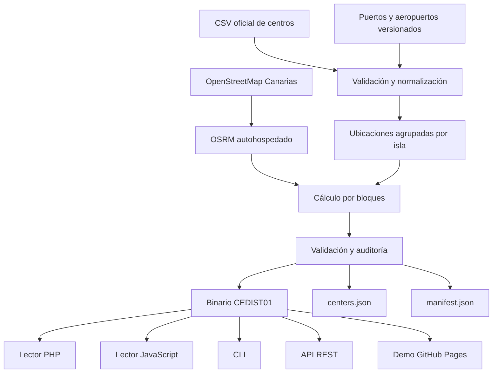

# Distancias entre centros educativos de Canarias

Matriz abierta y versionada de distancias y tiempos por carretera entre centros educativos, aeropuertos y puertos principales de Canarias, generada con datos oficiales y OpenStreetMap.

Estado: implementación inicial. GitHub Pages genera los artefactos de producción directamente desde `main`; el repositorio incluye también un fixture ficticio de conformidad.

> La métrica es: «Distancia y duración correspondientes a la ruta para automóvil considerada más rápida por el perfil OSRM utilizado, sin tráfico en tiempo real». No representa la ruta más corta ni una predicción de tráfico real.

## Fuentes y privacidad

Los centros proceden del [Portal de Datos Abiertos de Canarias](https://datos.canarias.es/) mediante resolución CKAN con fallback configurable. Los aeropuertos y los puertos principales se mantienen en `config/transport-nodes.json`, con referencias a Aena, Puertos Canarios y las autoridades portuarias estatales. Sus coordenadas de acceso por carretera se contrastan con OpenStreetMap. La red viaria procede de OpenStreetMap/Geofabrik.

Por compatibilidad, `centers.json` conserva su nombre histórico, pero contiene todas las ubicaciones consultables. Solo conserva código, nombre, isla, municipio, localidad, dirección, código postal, coordenadas, naturaleza, tipo y metadatos mínimos de transporte; elimina teléfonos, correo, fax, fotos y campos no usados.

Los códigos sintéticos son numéricos y únicos: `98IINNNN` para aeropuertos y `99IINNNN` para puertos, donde `II` coincide con el identificador estable de la isla.

## Inicio rápido

```sh
make bootstrap
make test
bin/route-matrix --json query 10000001 10000002
```

PHP:

```php
$reader = new AteEducacion\CanariasRouteMatrix\Reader('/data/routes.bin', '/data/centers.json');
$route = $reader->getRoute('35000011', '98030001');
```

JavaScript:

```js
const matrix = await RouteMatrix.load({binaryUrl: './routes.bin', centersUrl: './centers.min.json'});
console.log(matrix.getRoute('35000011', '98030001'));
```

REST: `GET /v1/routes/{origin}/{destination}`. Los códigos se intercambian siempre como cadenas.

## Arquitectura



Los artefactos previstos son el binario, su copia Zstandard, dos JSON de ubicaciones con nombres compatibles, la definición de nodos de transporte, manifiesto, informes y `SHA256SUMS`. Sus conteos se leen del manifiesto, nunca se mantienen a mano.

## Desarrollo y pruebas

`make help`, `make lint`, `make test`, `make test-conformance`, `make docs-build` y `make docker-build`. En macOS: `brew install uv composer shellcheck shfmt`; en Ubuntu se usan los paquetes equivalentes. Consulte `CONTRIBUTING.md`.

## Actualización, documentación y demo

Cada `push` a `main` descarga las fuentes actuales, prepara OSRM, reconstruye la matriz y despliega GitHub Pages con esos mismos artefactos. No se necesita crear un tag para ver cambios en la demo.

Los tags `v*` crean snapshots opcionales en GitHub Releases. El workflow **Data release** también puede ejecutarse manualmente con un tag existente para reparar una publicación fallida sin mover ni recrear el tag.

Localmente pueden usarse `make download-centers validate-centers download-osm prepare-osrm build-data`. El sitio Zensical se sirve con `make docs-serve`; la demo estática consume una tríada coherente bajo `data/latest/`.

## Licencias, atribución y límites

Código MIT; documentación CC BY 4.0; fuentes y base derivada se tratan por separado en `DATA_LICENSES.md`. © OpenStreetMap contributors. Sin tráfico, incidencias, horarios ni restricciones temporales; solo automóvil; solo consultas dentro de una isla; coordenadas y red pueden quedar desactualizadas; una ruta no disponible no prueba que no exista acceso físico. Los puertos y aeropuertos son puntos de acceso por carretera: la matriz no representa trayectos marítimos o aéreos.

Contribuciones: `CONTRIBUTING.md`. Seguridad: `SECURITY.md`.
