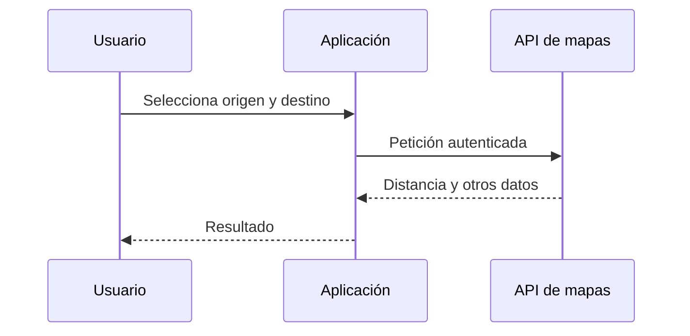
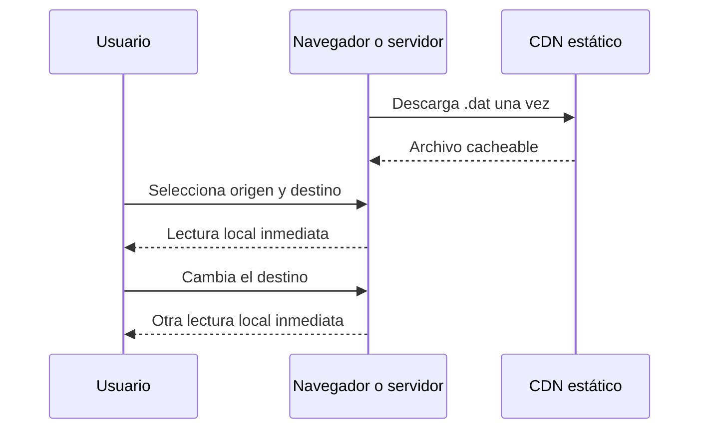

# Arquitectura

El sistema separa una fase de generación costosa y poco frecuente de una fase de consulta extremadamente sencilla. OSRM calcula las distancias cuando se publica una nueva versión; las aplicaciones consumidoras solo descargan un archivo estático y leen un entero.


## Fase de generación

1. Se resuelve y descarga el CSV oficial de centros educativos.
2. Se incorporan los puertos y aeropuertos definidos y versionados en el repositorio.
3. Se validan códigos, coordenadas, islas, duplicados y campos permitidos.
4. Cada coordenada se ajusta al punto accesible más cercano de la red viaria de OSRM.
5. Las ubicaciones se agrupan por isla.
6. OSRM calcula tablas dirigidas por bloques solicitando únicamente la anotación `distance`.
7. Los resultados se redondean a metros enteros y se escriben en CEDIST02.
8. Se generan el manifiesto, los informes y los hashes SHA-256.

El trabajo intensivo sucede aquí. La generación puede tardar, pero se ejecuta una sola vez por versión de datos, no una vez por usuario o consulta.

## Fase de consulta

Para resolver una pareja origen-destino:

1. El código de origen se busca en el índice global ordenado: `O(log n)`.
2. Se repite la búsqueda para el destino: `O(log n)`.
3. Se comprueba que ambos pertenecen a la misma isla.
4. Se calcula la posición `origen × número_de_ubicaciones + destino`.
5. Se leen cuatro bytes en esa posición: `O(1)`.

No se ejecuta un algoritmo de caminos, no se abre una base de datos y no se consulta una API externa. En JavaScript la lectura se hace sobre un `ArrayBuffer`; en PHP se usa `fseek()` seguido de `fread(4)`.

## Por qué CEDIST02 solo almacena distancia

CEDIST01 guardaba dos matrices cuadradas completas por isla:

```text
n × n × 4 bytes de distancia
n × n × 4 bytes de duración
```

CEDIST02 conserva únicamente la primera. Como cabeceras e índices ocupan muy poco frente a las matrices, el archivo sin comprimir se reduce prácticamente a la mitad. También se reduce el volumen solicitado a OSRM durante la generación y el número de valores que deben validarse, escribirse, comprimirse y distribuirse.

La duración se eliminó porque el objetivo del proyecto es ofrecer una referencia estable de distancia. Un tiempo sin tráfico real puede interpretarse como una estimación de viaje actual cuando no lo es.

## Comparación con una API de mapas

Una integración tradicional con Google Maps u otro proveedor de rutas suele seguir este patrón:



Ese modelo es apropiado cuando se necesitan rutas actuales, tráfico, restricciones dinámicas o ubicaciones arbitrarias. Para un conjunto cerrado y conocido de ubicaciones tiene varios costes evitables:

- una petición remota por consulta o por lote;
- latencia de red en cada interacción;
- dependencia de disponibilidad, credenciales, cuotas y condiciones de un tercero;
- resultados que pueden cambiar entre llamadas;
- necesidad de proteger claves y controlar consumo;
- dificultad para reproducir exactamente una versión histórica.

La matriz estática cambia ese patrón:



El coste de cálculo se amortiza entre todas las consultas y todos los consumidores. GitHub Pages o cualquier CDN puede cachear el mismo archivo, y las aplicaciones no necesitan secretos.

## Decisiones de diseño

### Matrices dirigidas por isla

Las distancias no se consideran simétricas: sentidos únicos, accesos y enlaces viarios pueden hacer que A→B difiera de B→A. Separar por isla evita almacenar combinaciones que el proyecto no puede resolver por carretera.

### Códigos numéricos de ocho cifras

Los códigos públicos se transmiten como cadenas, pero se almacenan como `uint32`. El índice ocupa 12 bytes por ubicación y permite una búsqueda binaria simple en todos los lenguajes.

### Archivo sin compresión para consulta

El `.dat` no está comprimido porque debe permitir acceso aleatorio. La copia `.dat.zst` sirve para descarga o archivo, pero debe descomprimirse antes de usar los lectores.

### Metadatos separados

Los nombres y otros campos descriptivos permanecen en `centers.min.json`. El `.dat` contiene únicamente lo necesario para localizar una distancia. Esto mantiene estable y pequeño el formato binario.

## Límites del enfoque

La eficiencia se consigue aceptando un conjunto explícito de límites:

- solo ubicaciones publicadas en el conjunto de datos;
- solo distancias dentro de la misma isla;
- perfil de automóvil y red disponibles en la fecha de generación;
- sin tráfico, obras o incidencias en tiempo real;
- el resultado representa la ruta considerada más rápida por el perfil usado, no necesariamente la ruta geométricamente más corta.

Cuando una aplicación necesite información dinámica puede combinar esta matriz como respuesta rápida o valor de referencia con una API de rutas bajo demanda para los casos que realmente la requieran.
