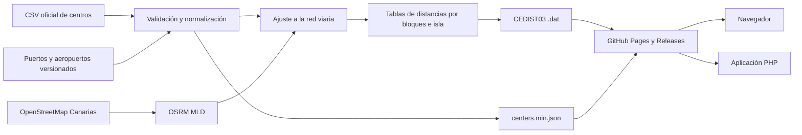

# Arquitectura

El sistema separa una fase de generación costosa y poco frecuente de una fase de consulta sencilla. OSRM calcula las distancias cuando se publica una nueva versión; las aplicaciones consumidoras solo descargan un archivo estático CEDIST03 y leen un entero.

## Fase de generación

1. Se resuelve y descarga el CSV oficial de centros educativos.
2. Se incorporan los puertos y aeropuertos definidos y versionados en el repositorio.
3. Se validan códigos, coordenadas, islas, duplicados y campos permitidos.
4. Cada coordenada se ajusta al punto accesible más cercano de la red viaria de OSRM.
5. Las ubicaciones se agrupan por isla.
6. OSRM calcula tablas dirigidas por bloques con un perfil de automóvil cuyo peso es la distancia, y devuelve la anotación `distance`.
7. Se calcula la máxima distancia y se comprueba que no supera 655.340 metros.
8. Los metros de OSRM se redondean a decámetros y se escriben en CEDIST03.
9. Se generan el manifiesto, los informes y los hashes SHA-256.

El trabajo intensivo sucede en esta fase. La generación se ejecuta una vez por versión de datos, no una vez por usuario o consulta.

## Fase de consulta

Para resolver una pareja origen-destino:

1. El código de origen se busca en el índice global ordenado: `O(log n)`.
2. Se repite la búsqueda para el destino: `O(log n)`.
3. Se comprueba que ambos pertenecen a la misma isla.
4. Se calcula la posición `origen × número_de_ubicaciones + destino`.
5. Se leen dos bytes en esa posición: `O(1)`.
6. El `uint16` se multiplica por 10 para devolver metros.

No se ejecuta un algoritmo de caminos, no se abre una base de datos y no se consulta una API externa. En JavaScript la lectura se hace sobre un `ArrayBuffer`; en PHP se usa `fseek()` seguido de `fread(2)`.

## Comparación con una API de mapas

Una integración tradicional con un proveedor de rutas suele hacer una petición autenticada por consulta. Ese modelo es apropiado cuando se necesitan rutas actuales, tráfico, restricciones dinámicas o ubicaciones arbitrarias. Para un conjunto cerrado y conocido de ubicaciones tiene costes evitables:

- latencia de red en cada interacción;
- dependencia de disponibilidad, credenciales y cuotas;
- resultados que pueden cambiar entre llamadas;
- dificultad para reproducir una versión histórica.

La matriz estática se descarga una vez y resuelve después todas las consultas localmente. GitHub Pages o cualquier CDN puede cachear el mismo archivo y las aplicaciones no necesitan secretos.

## Decisiones de diseño

### Matrices dirigidas por isla

Las distancias no se consideran simétricas: sentidos únicos, accesos y enlaces viarios pueden hacer que A→B difiera de B→A. Separar por isla evita almacenar combinaciones que el proyecto no puede resolver por carretera.

### Códigos numéricos de ocho cifras

Los códigos públicos se transmiten como cadenas, pero se almacenan como `uint32`. El índice ocupa 12 bytes por ubicación y permite una búsqueda binaria simple en todos los lenguajes.

### Archivo único para consulta y distribución

El proyecto publica directamente `canarias-distances.dat`. El archivo usa celdas de dos bytes y permite acceso aleatorio inmediato, sin dependencias de compresión ni pasos de descompresión en los consumidores.

### Metadatos separados

Los nombres y otros campos descriptivos permanecen en `centers.min.json`. El `.dat` contiene únicamente lo necesario para localizar una distancia.

## Límites del enfoque

- solo ubicaciones publicadas en el conjunto de datos;
- solo distancias dentro de la misma isla;
- perfil de automóvil y red disponibles en la fecha de generación;
- precisión de 10 metros;
- sin tráfico, obras o incidencias en tiempo real;
- el resultado representa el camino accesible de menor distancia en la red y perfil usados, no la distancia en línea recta ni el itinerario efectivamente recorrido.
