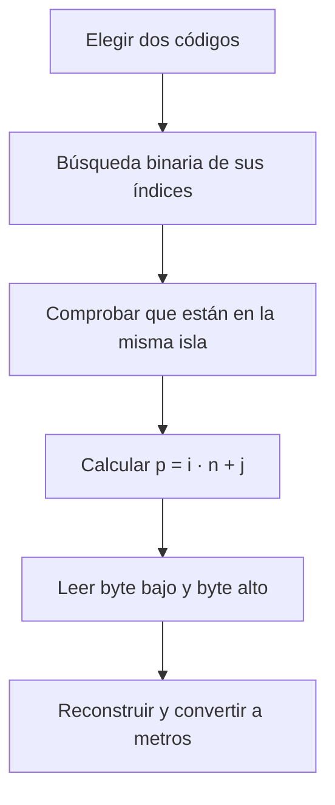

# La matemática que hace rápida la calculadora

La calculadora parece resolver una ruta al instante, pero el trabajo difícil ya
se hizo antes. Al publicar cada versión, **OSRM calcula las distancias por
carretera** y el proyecto las organiza en matrices. Cuando alguien elige dos
centros, el navegador solo localiza una celda y lee dos bytes.

Esta separación entre **calcular una vez** y **consultar muchas veces** es la
idea matemática central del proyecto.

<div class="lesson-summary" markdown>

**Idea para recordar**

> Una consulta no busca caminos en un mapa: busca una respuesta ya calculada en
> una tabla. La velocidad se obtiene trasladando el esfuerzo desde el momento de
> la consulta al momento de generar los datos.

</div>

## 1. Del mapa a una matriz

Para una isla con \(n\) ubicaciones, se construye una matriz cuadrada dirigida:

$$
D = (d_{ij})_{n \times n}
$$

Cada fila representa un origen y cada columna, un destino:

|  | Destino 0 | Destino 1 | Destino 2 |
|---|---:|---:|---:|
| **Origen 0** | \(d_{00}=0\) | \(d_{01}\) | \(d_{02}\) |
| **Origen 1** | \(d_{10}\) | \(d_{11}=0\) | \(d_{12}\) |
| **Origen 2** | \(d_{20}\) | \(d_{21}\) | \(d_{22}=0\) |

La diagonal vale cero porque origen y destino coinciden. La matriz es
**dirigida**, así que no se supone que sea simétrica:

$$
d_{ij} \neq d_{ji}\quad\text{en general}
$$

Una calle de sentido único, una mediana o un acceso distinto a una carretera
pueden hacer que la ida y la vuelta recorran distancias diferentes. Por eso no
sería correcto guardar solo la mitad triangular de la matriz.

## 2. Convertir dos coordenadas en una posición

La matriz se guarda por filas. Si el origen ocupa el índice local \(i\), el
destino el índice \(j\) y la isla contiene \(n\) ubicaciones, la celda buscada
ocupa la posición:

$$
p = i\,n + j
$$

Por ejemplo, en una matriz de \(n=5\), la distancia desde el origen \(i=2\) al
destino \(j=3\) está en:

$$
p = 2\cdot5+3=13
$$

No hay que recorrer las trece posiciones anteriores. El programa calcula
directamente el desplazamiento, igual que se localiza una vivienda con el
número de calle y de portal.



## 3. Dos bytes para representar una distancia

Las distancias se guardan en **decámetros**: una unidad almacenada equivale a
10 metros. Para una distancia positiva \(d\), expresada en metros, se aplica:

$$
q = \max\left(1,\left\lfloor\frac{d+5}{10}\right\rfloor\right)
$$

Al consultar, se recupera una aproximación en metros:

$$
\widehat d = 10q
$$

Así, 1.234 m se publican como 1.230 m y 1.235 m como 1.240 m. Para
\(d\geq5\) m, el error de cuantización cumple:

$$
\left|\widehat d-d\right|\leq5\text{ m}
$$

Las distancias positivas menores de 5 m constituyen el caso especial: se
guardan como 10 m para que el valor cero quede reservado a la diagonal. En ese
intervalo el error máximo es inferior a 10 m.

El número \(q\) cabe en un entero sin signo de 16 bits. Sus dos bytes se
reconstruyen mediante:

$$
q = b_{\mathrm{bajo}} + 256\,b_{\mathrm{alto}}
$$

El valor `0xFFFF` se reserva para «distancia no disponible», de modo que el
mayor valor utilizable es `0xFFFE`:

$$
(2^{16}-2)\cdot10=655\,340\text{ m}
$$

## 4. ¿Dónde está la ganancia de eficiencia?

### Tiempo de consulta

Sea \(N\) el número total de ubicaciones. Sus códigos están ordenados, por lo
que cada código se encuentra mediante búsqueda binaria en \(O(\log N)\). Una
vez conocidos \(i\) y \(j\), calcular \(p\) y leer la celda cuesta \(O(1)\).

Por tanto, la consulta completa es:

$$
T_{\mathrm{consulta}}(N)=2O(\log N)+O(1)=O(\log N)
$$

Es importante expresarlo con precisión: **el acceso a la distancia es
constante**, pero la consulta completa incluye localizar los dos códigos. No se
ejecuta un algoritmo de caminos ni se hace una petición de red.

### Espacio ocupado

Si hay \(I\) islas y la isla \(k\) contiene \(n_k\) ubicaciones, entonces:

$$
N=\sum_{k=1}^{I}n_k
$$

Solo se almacenan recorridos dentro de cada isla. El número de celdas es:

$$
C=\sum_{k=1}^{I}n_k^2
$$

El tamaño exacto del archivo CEDIST04, antes de comprimir, es:

$$
S=64+12N+16I+2\sum_{k=1}^{I}n_k^2\quad\text{bytes}
$$

Los términos corresponden a la cabecera, el índice global, el directorio de
islas y las matrices. Una única matriz canaria tendría \(N^2\) celdas. Separar
por islas evita:

$$
N^2-\sum_{k=1}^{I}n_k^2
=2\sum_{a<b}n_an_b
$$

celdas que representarían trayectos por carretera entre islas distintas. Es
una reducción con significado geográfico: el modelo no finge conexiones que no
existen en la red viaria.

!!! example "Ejemplo de aula con números sencillos"

    Si tres islas tuvieran 4, 3 y 2 ubicaciones, una matriz conjunta necesitaría
    \((4+3+2)^2=81\) celdas. Las matrices separadas usarían
    \(4^2+3^2+2^2=29\). Se evitan 52 celdas sin perder ninguna ruta terrestre
    válida dentro de las islas.

### Coste amortizado

Sea \(G\) el coste de generar todas las matrices, \(L\) el coste de una lectura
local y \(R\) el coste de resolver una ruta bajo demanda. Después de \(Q\)
consultas:

$$
T_{\mathrm{matriz}}(Q)=G+QL
$$

$$
T_{\mathrm{bajo\ demanda}}(Q)=QR
$$

La precalculación compensa cuando:

$$
Q>\frac{G}{R-L}\qquad\text{si }R>L
$$

Esta fórmula demuestra el principio, pero no fija un número universal de
consultas: \(G\), \(L\) y \(R\) deben medirse en el entorno real. El proyecto
no publica tiempos que no hayan sido obtenidos mediante benchmarks
reproducibles.

## 5. Por qué los planos de bytes comprimen mejor

CEDIST04 guarda primero todos los bytes bajos y después todos los altos:

```text
Plano bajo:  L₀ L₁ L₂ L₃ …
Plano alto:  H₀ H₁ H₂ H₃ …
```

Esta reorganización no elimina información. Para cada posición \(p\), el valor
se recupera exactamente como \(L_p+256H_p\). Su ventaja aparece al comprimir:
los bytes altos de distancias cercanas tienden a repetirse y, al estar juntos,
el compresor detecta mejor esos patrones.

Los índices locales también se ordenan mediante un recorrido determinista del
vecino más cercano. Esto coloca próximas muchas filas y columnas con valores
parecidos. Es una optimización **sin pérdida**: cambia el orden de
almacenamiento, no las distancias.

## 6. Lectura geográfica del resultado

La distancia de la matriz no es la distancia en línea recta. Si dos puntos
tienen latitudes y longitudes conocidas, la distancia geodésica responde a
«¿qué separación hay sobre la superficie terrestre?». Este proyecto responde a
otra pregunta: «¿qué distancia tiene la ruta por la red viaria según el perfil
y los datos usados en esa versión?».

Por eso intervienen elementos geográficos como:

- el relieve y el trazado de las carreteras;
- los accesos reales a cada ubicación;
- los sentidos de circulación;
- la insularidad y la ausencia de conexión viaria entre islas;
- la fecha de los datos de OpenStreetMap y el perfil de automóvil de OSRM.

La ruta elegida por el perfil puede ser la considerada más rápida sin ser la
geométricamente más corta. Tampoco incorpora tráfico, obras ni incidencias en
tiempo real. La matriz es reproducible precisamente porque representa una
**versión fija** del territorio y de la red.

## 7. Propuestas para trabajar en clase

1. **Índices y matrices.** Construir una matriz dirigida de cinco lugares y
   localizar varias parejas con \(p=i\,n+j\).
2. **Asimetría.** Buscar un ejemplo urbano donde la ida y la vuelta sean
   diferentes y explicar qué elemento viario la provoca.
3. **Error de redondeo.** Calcular \(q\), \(\widehat d\) y el error absoluto para
   varias distancias, incluyendo valores a ambos lados de una mitad de decámetro.
4. **Insularidad.** Comparar \(N^2\) con \(\sum n_k^2\) usando cantidades de
   ubicaciones por isla y explicar las celdas que se evitan.
5. **Escala y modelo.** Comparar distancia geodésica y distancia por carretera;
   debatir cuál responde mejor a distintas preguntas geográficas.
6. **Amortización.** Proponer valores hipotéticos para \(G\), \(L\) y \(R\) y
   calcular a partir de qué \(Q\) conviene precalcular.

<div class="lesson-summary" markdown>

**Conclusión**

La eficiencia no procede de una fórmula que encuentre rutas más deprisa en el
navegador. Procede de modelar bien el problema: conjunto cerrado de ubicaciones,
matrices separadas por isla, valores cuantizados en dos bytes y acceso directo
a una celda. La geografía decide qué relaciones tienen sentido; las matemáticas
permiten almacenarlas y consultarlas con muy poco trabajo.

</div>

Para profundizar en la implementación, consulta [Arquitectura](architecture.md),
[Formato CEDIST04](binary-format.md) y [Generación](generation.md).
